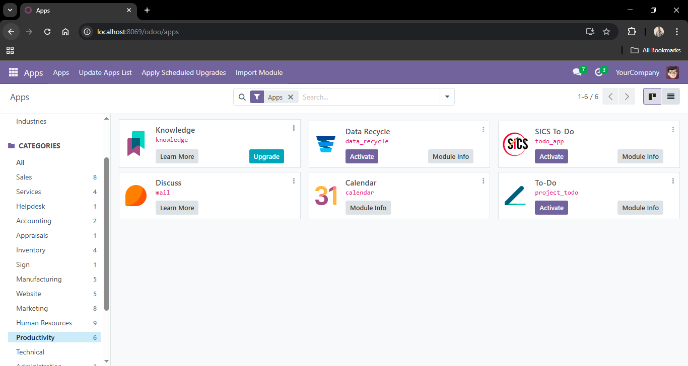

Advanced To-Do Application for Odoo 18
The Advanced To-Do Application is a custom Odoo module designed to manage tasks with advanced features such as prioritization, categories, due dates, and a Kanban dashboard. Built for Odoo 18, this app provides a user-friendly interface for task management, complete with progress tracking, state transitions, and chatter integration for communication.

*A screenshot showing the list view of tasks with state columns and progress bars*

Features

Task Management: Create, edit, and delete tasks with fields for name, description, priority, due date, category, and assigned user.
State Transitions: Manage task states (Draft, In Progress, Done, Cancelled) with dedicated buttons in the form view.
Progress Tracking: Automatically update task progress (0% for Draft/Cancelled, 50% for In Progress, 100% for Done) with a progress bar widget.
Kanban View: Visualize tasks in a Kanban board grouped by state, with all states (Draft, In Progress, Done, Cancelled) always visible, even when empty.
Categories: Organize tasks into categories with a dedicated tree and form view.
Chatter Integration: Track task changes and communicate via Odoo’s chatter (requires mail module).
Priority Levels: Assign Low, Medium, or High priority to tasks.
User Assignment: Assign tasks to specific users, defaulting to the current user.
Responsive Views: Supports tree, form, and Kanban views for flexible task management.

Requirements

Odoo Version: 18.0
Dependencies: 
base (core Odoo module)
web (for Kanban and UI components)
mail (for chatter and activity tracking, included in standard Odoo)

Database: PostgreSQL (compatible with Odoo 18)
Operating System: Windows, Linux, or macOS

Installation

Clone the Repository:
git clone https://github.com/DabalaYonas/todo-app-odoo.git

Place the Module:

Move the todo_app folder to your Odoo custom addons directory (e.g., /path/to/odoo/custom_addons/).
Example for Windows:move todo_app C:\Users\daboy\Documents\odoo-18\custom_addons\

Update Odoo Configuration:

Ensure the custom addons path is included in your odoo.conf file:[options]
addons_path = /path/to/odoo/odoo/addons,/path/to/odoo/custom_addons

Example for Windows:addons_path = C:\Users\daboy\Documents\odoo-18\odoo\addons,C:\Users\daboy\Documents\odoo-18\custom_addons

Restart Odoo Server:

Restart your Odoo server to load the module:python3 -m odoo -c /path/to/odoo.conf

For Windows:python -m odoo-bin -c C:\Users\daboy\Documents\odoo-18\odoo.conf

Or, if running as a service:net stop odoo
net start odoo

Update Apps List:

Log in to Odoo with administrator privileges.
Enable Developer Mode (Settings > Activate Developer Mode).
Go to Apps and click Update Apps List.

Install the Module:

In the Apps menu, search for SICS To-Do and click Install.

*A screenshot showing SICS To-Do app in apps*

Clear Cache (Optional):

Clear your browser cache or use an incognito window.
Restart Odoo with --no-http-cache to clear server-side cache:python3 -m odoo -c /path/to/odoo.conf --no-http-cache

Usage

Access the App:

After installation, find the “SICS To-Do” menu in Odoo’s main menu.
Navigate to Tasks to view tasks in tree, form, or Kanban views.
Navigate to Categories to manage task categories.

Create a Task:

Click Create in the Tasks view.
Fill in details (e.g., Task Name, Priority, Due Date, Category, Assigned To).
Use buttons in the form view to transition states (Start Task, Mark as Done, Cancel Task).

Manage Categories:

Go to Categories to create or edit task categories.
Assign categories to tasks via the Category field.

Kanban View:

Switch to Kanban view to see tasks grouped by state.
All states (Draft, In Progress, Done, Cancelled) are always visible.
Drag tasks between columns to change their state.
Progress bars reflect task progress (0%, 50%, 100%).

Track Changes:

Task state changes and messages are logged in the chatter at the bottom of the form view.

Module Structure
todo_app/
├── __init__.py
├── __manifest__.py
├── models/
│   └── todo_task.py  # Task and Category models
├── views/
│   ├── todo_menu.xml     # Menu definitions and Actions for categories
│   ├── todo_task_views.xml  # Task views (tree, form, Kanban)
├── security/
│   └── ir.model.access.csv  # Access rights
├── static/
│   ├── description/
│   │   └── icon.png  # Module icon

Development

Models: Defined in models/todo_task.py with todo.task and todo.category.
Views: Tree, form, and Kanban views in views/todo_task_views.xml. Category views in todo_menu.xml.
Security: Access rights defined in security/ir.model.access.csv for base.group_user.

Debugging

Enable debug logging:python3 -m odoo -c /path/to/odoo.conf --log-level=debug --log-handler=odoo.tools.convert:DEBUG

Check browser console (F12 > Console) for JavaScript errors.
Inspect database views:SELECT * FROM ir_ui_view WHERE name LIKE 'todo.task%';

Contributing

Fork the repository.
Create a feature branch (git checkout -b feature/your-feature).
Commit your changes (git commit -m "Add your feature").
Push to the branch (git push origin feature/your-feature).
Open a Pull Request.

Please include a detailed description of your changes and test steps.
License
This module is licensed under the LGPL-3.0, compatible with Odoo’s licensing.
Issues
Report bugs or request features via GitHub Issues. Provide:

Odoo version
Error logs
Steps to reproduce
Screenshots (if applicable)

Author

Dabala Yonas (replace with your name or GitHub handle)
Contributions welcome!
